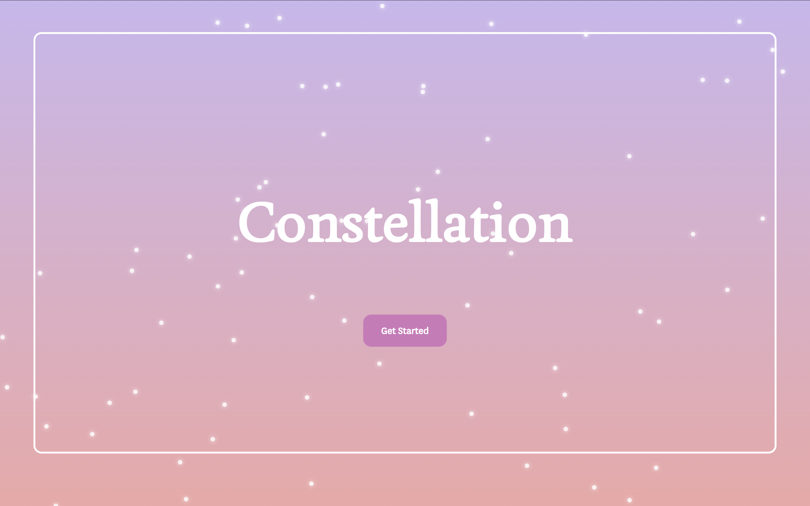
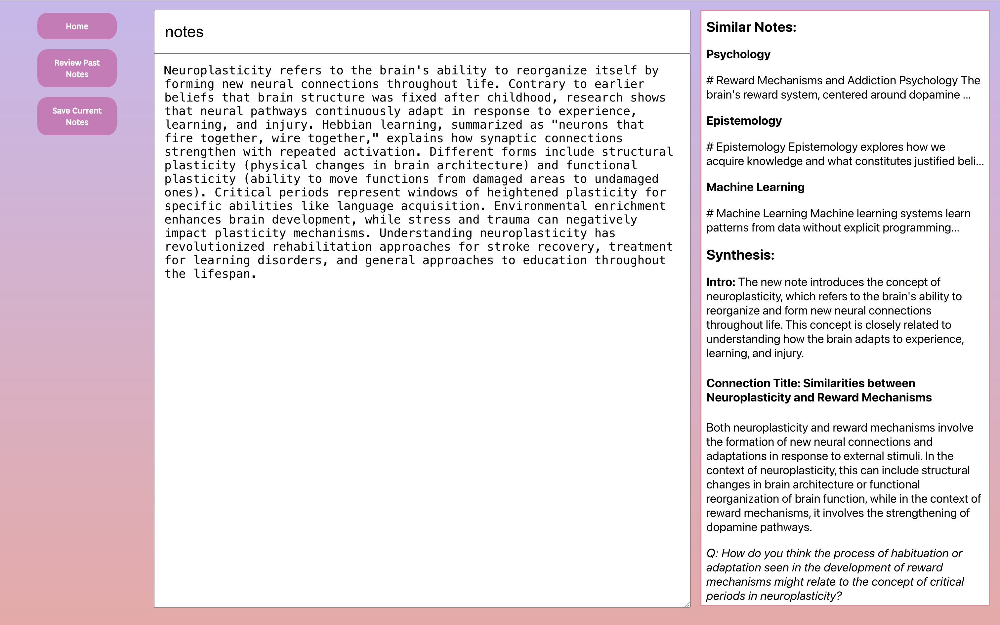
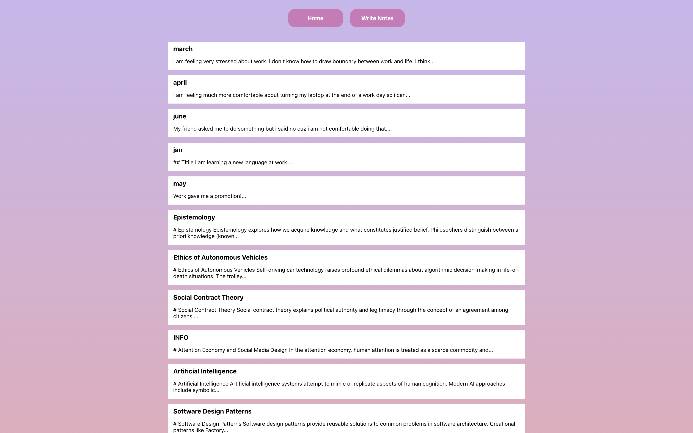
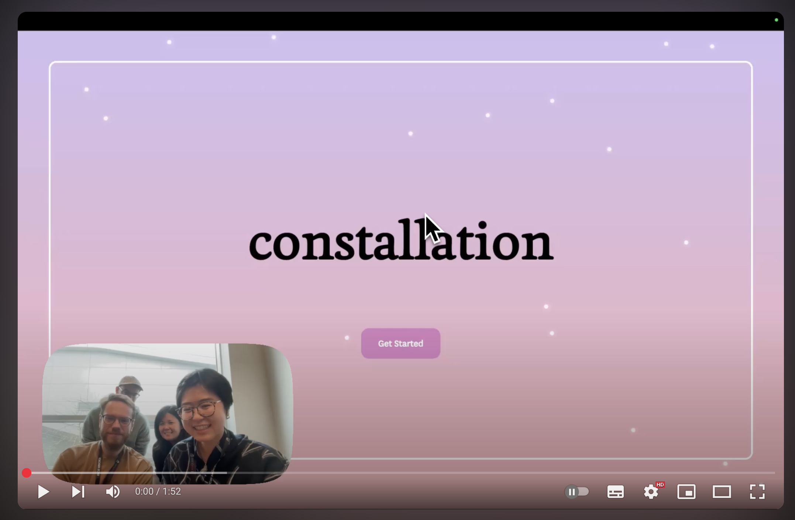
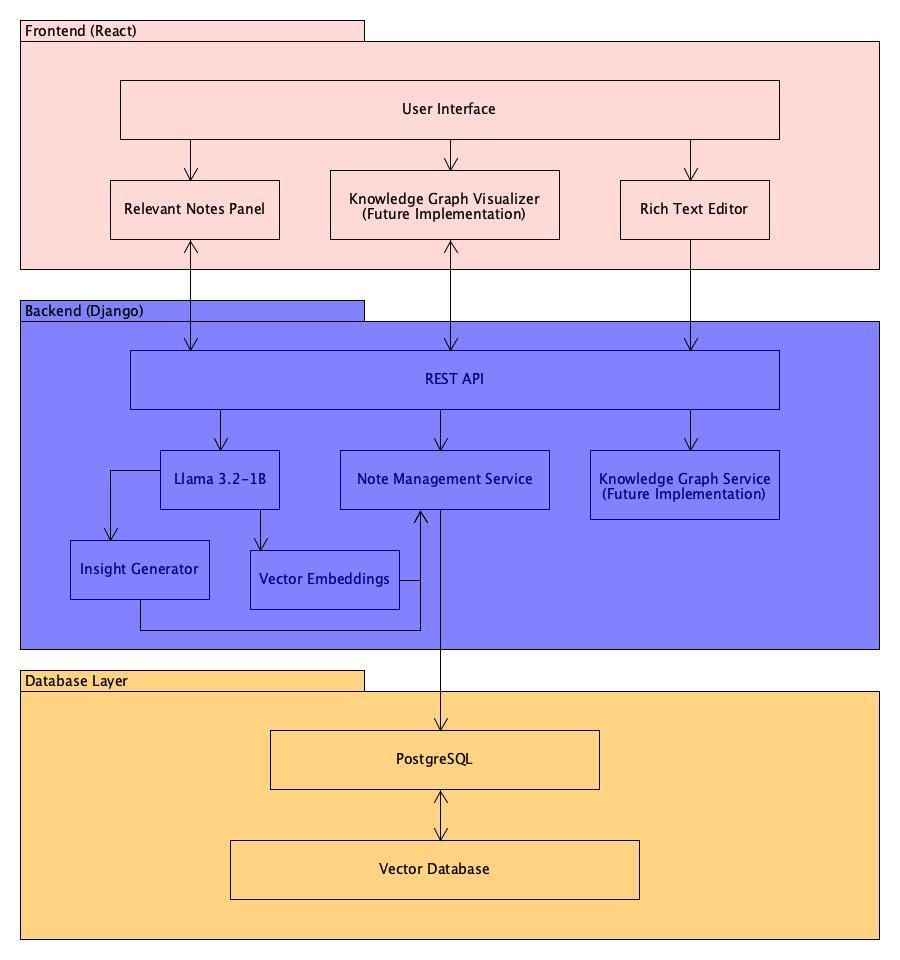

# Constellation 

### Hackathon submission for [2025 BCS Hacks](https://devpost.com/software/bcs-hacks)




## Inspiration
Ever returned to a topic months later, only to realize you’ve forgotten your notes, insights, or where you left off? With Constellation, that fragmented learning experience becomes a thing of the past. As you take new notes, Constellation automatically surfaces related ideas from your past entries, helping you make meaningful connections across time. It ensures you’re building on your existing knowledge instead of repeating yourself—turning note-taking into an evolving, intelligent conversation with your own mind.

## Demo: 
[](https://www.youtube.com/watch?v=a8xt9mVNp-Y)

## What it does
Constellation seamlessly analyzes your text/markdown notes using a lightweight local LLM (Llama 3.2-1B) to identify semantic relationships between concepts across your personal knowledge base. Without any manual tagging or organization required, it creates an intuitive mind map of your ideas, highlighting connections you might never have discovered on your own. Whether you're a student connecting concepts across disciplines, a researcher tracking the evolution of your thinking, a writer synthesizing ideas for your next project, or someone journaling to track personal growth over time, Constellation helps you leverage your entire knowledge history. For journal writers, it surfaces past reflections that reveal how your perspective has evolved on important life themes, allowing you to recognize patterns, celebrate progress, and gain deeper self-awareness through the constellation of your own thoughts.RetryClaude can make mistakes. 

## How we built it
- Frontend: A responsive React interface designed for focused writing, with seamless suggestions and connections.
- Backend: A Django backend handles note management, similarity queries, and knowledge graph logic.
- AI Engine: A locally hosted Llama 3.2-1B model via Ollama analyzes notes and generates vector embeddings—ensuring privacy and speed.
- Vector Similarity: Semantic similarity is calculated using cosine similarity between note embeddings.
- Storage: PostgreSQL is used to store notes and their corresponding embeddings, containerized with Docker for easy deployment.



## What's next (improvements) 
- knowledge graph visualizer: Build an interactive graph view to explore how your thoughts connect over time.
- keyword & theme mapping: Develop an inverted index based on recurring themes or keywords to support instant retrieval - even as the note archive scales.
- maybe put everything (frontend, backend, llama) in one container 

## Try it for yourself 

### To Set Up Conda Env
windows:

```
conda env create -f environment.yml
conda activate stack
```

macOS:

```
conda env create -f environment-mac.yml
conda activate stack

```

### Set up docker

- Download docker from http://docker.com/get-started/
- Create the .ENV file inside after creating the container `/bcs-hacks-roots/backend`: 
```
DB_NAME=your_db_name
DB_USER=your_user
DB_PASSWORD=your_password
DB_HOST=localhost
DB_PORT=5432
```

### Set up the database with docker and postgres

- In terminal navigate to `/bcs-hacks-roots/backend`:
- `docker-compose up -d`
- Other helpful docker commands 
```
docker ps         # Check running containers
docker-compose down  # Stop and remove containers
```
- if you run into user role doesn't exist, and your user actually exist, run `ps aux | grep postgres` and see if you have a local PostgreSQL instance running on your machine at the same time as your Docker PostgreSQL instance.
    - You can run `brew services stop postgresql@16` (mac only and if you have homebrew) to stop the local postgres instance - find other code for windows 
    - or you can change port mapping in the container and update in the ENV file. 
    ```
    # Stop the current container
    docker stop backend-db-1
    # Remove it (if needed)
    docker rm backend-db-1
    # Start it again with a different port mapping, e.g., 5433
    docker run -d --name backend-db-1 -p 5433:5432 ... (other options)
    ```
    

### Push the test data to the database

- Run `data_push.ipynb` to push the test data from the repo to the database.
- You can switch the path in the file to other test folders if you want to push more test data to the database.
- You can also upload or creat more test data into the resources folder. Just make sure to update the file path.

### useful SQL command

`docker exec -it <database-container-name> psql -U <user-name> -d <database-name>`

- check number of rows in the note_data table
` select count(*) from note_data`
- wipe the table and reset the auto-increment ID counter
`TRUNCATE TABLE note_data RESTART IDENTITY;`
- see all title values from the note_data table
`select title from note_data;`

### Start the app

In one terminal:

- Navigate to the backend directory `/bcs-hacks-roots/backend`
- Type `conda activate stack` (if not already in stack), `python manage.py runserver`
  In another terminal:
- Navigate to the frontend directory `/bcs-hacks-roots/frontend`
- Type `conda activate stack`(if not already in stack), `npm install`, then `npm start`
  You should be able to access the app at (http://localhost:3000)
